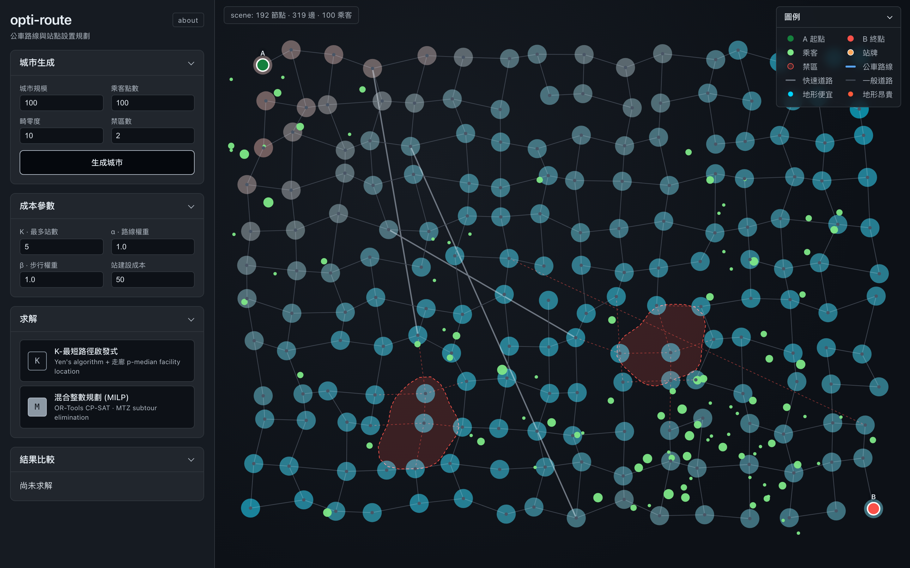
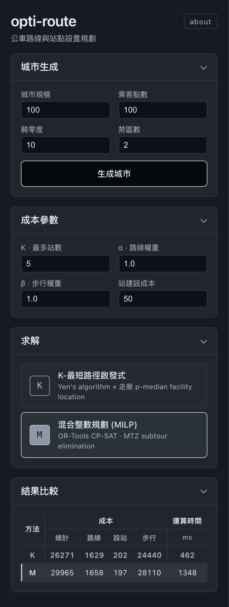
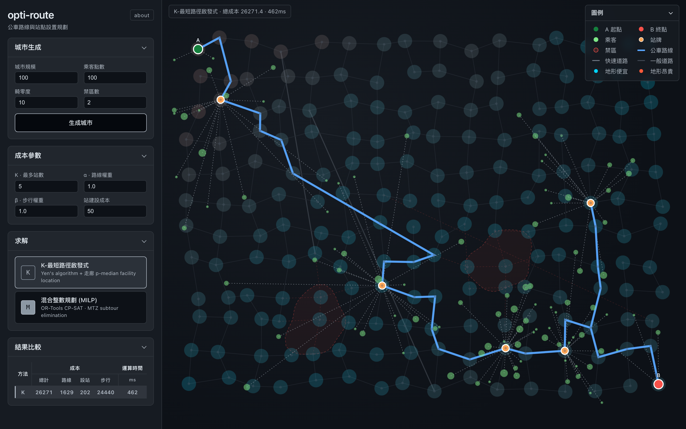
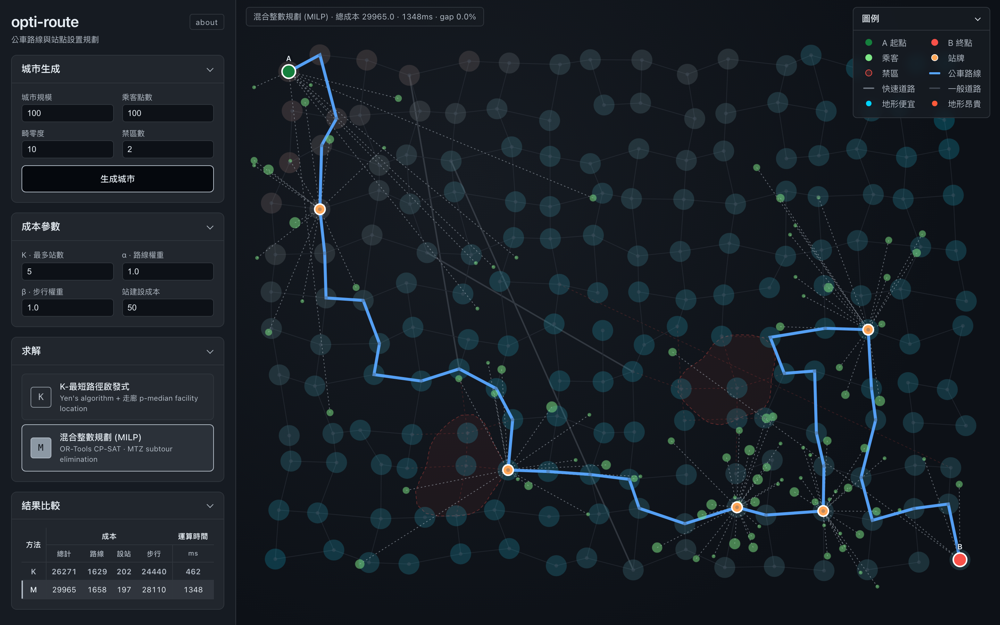
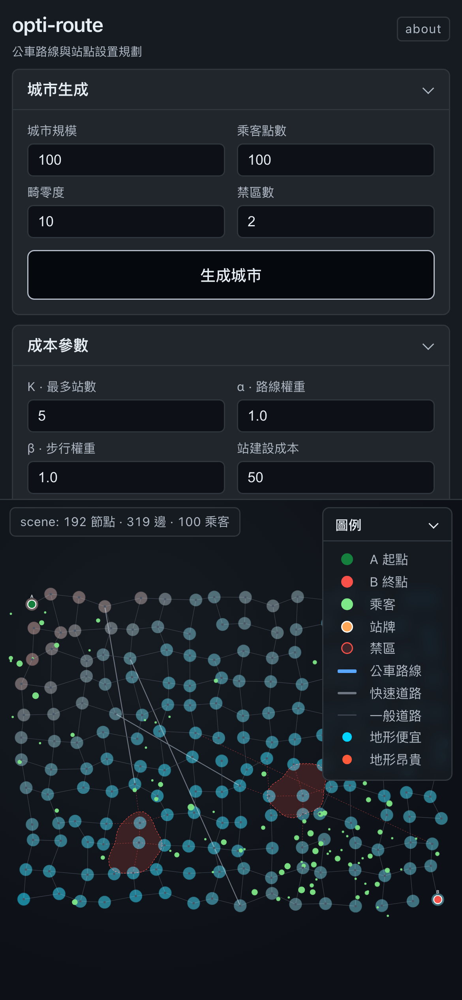

# opti-route

> 公車主路線設計 + 站點選址的**聯合最佳化**互動 demo。把兩個傳統上分開處理的問題建模為單一耦合問題，用兩種風格的解法並排比較。

**🌐 Live demo:** [opti-route.max-the-solution.com](https://opti-route.max-the-solution.com/)



完整技術細節（建模、約束、debug 故事）請見 **[docs/ALGORITHMS.md](docs/ALGORITHMS.md)**。

---

## Quick start（本機跑）

```bash
git clone https://github.com/MaxShih147/opti-route
cd opti-route

/opt/homebrew/bin/python3.12 -m venv .venv
.venv/bin/pip install -r backend/requirements.txt
.venv/bin/uvicorn backend.main:app --port 8765

open http://localhost:8765/
```

需要 Python 3.12+（用了較新的 type hint 語法）。

---

## 操作步驟

### 1 · 控制面板（左側）



由上而下：

| 區塊 | 用途 |
|---|---|
| **城市生成** | 規模、乘客數、畸零度、禁區數 → 按「生成城市」每次隨機種子 |
| **成本參數** | K（最多站數）、α（路線權重）、β（步行權重）、站建設成本 |
| **求解** | 點 [K] 或 [M] 求解；二次點同一顆會從 cache 切換顯示，不重算 |
| **結果比較** | 並排兩種方法的總計、路線、設站、步行、運算時間 |

每個面板都可以摺疊（點標題）。

### 2 · 跑啟發式 KSP

按下 **[K] K-最短路徑啟發式** 後：



- **藍粗線** 是公車路線
- **橘色甜甜圈** 是站牌（含 A、B 共 5 個）
- **灰虛線** 是乘客→指派站的步行軌跡
- 背景的道路、地形、禁區會自動淡化讓主結果突顯

頂部 status 條會顯示 `K-最短路徑啟發式 · 總成本 ... · ...ms`。

### 3 · 跑精確解 MIP

按 **[M] 混合整數規劃 (MILP)**：



可以對比兩條路線的「形狀」差異 — KSP 有時會用支線繞行（spur），MIP 不會。

下方表格自動匯總兩種方法的數據：

```
方法   |        成本             | 運算時間
       | 總計  路線  設站  步行  |     ms
─────────────────────────────────────────
◆ K    | 26271 1629  202  24440 |    462
◆ M    | 29965 1658  197  28110 |   1348
```

◆ 標記是當前顯示在地圖上的方法、綠色底是當前場景下總成本最低者。點按鈕或表格任一列都能切換顯示。

### 4 · 手機版



≤ 900px 寬度自動把控制面板堆在上半部、地圖在下半部；≤ 500px 進一步壓縮版面（雙欄圖例變單欄）。可以在 iOS Safari 隱私分頁直接看。

### 5 · About 頁

右上的「about」連結到 `/about`，是個人介紹 + 專案動機 + 兩種解法簡介。

---

## 兩個解法（簡短版）

| 方法 | 類型 | 核心技術 | 規模 |
|---|---|---|---|
| **K-最短路徑啟發式** | Heuristic | Yen K-shortest + corridor p-median + path repair | 1000+ nodes |
| **混合整數規劃** | Exact | OR-Tools CP-SAT + MTZ subtour elimination | ~400 nodes (timeout) |

兩個都根據圖規模自動調參數（不需要手動）。

**有趣的觀察**：大場景下 KSP 反而會**勝過** MIP，因為 KSP 允許「支線繞行（spur）」、MIP 強制簡單路徑。這不是 bug —— 是兩個方法的可行解空間根本不同。

詳細討論看 [docs/ALGORITHMS.md §5–6](docs/ALGORITHMS.md)。

---

## 結果範例

### 中型場景（200 路口、100 乘客）

```
方法              總計     路線    設站    步行    ms
K-最短路徑啟發式  26271    1629    202    24440    462
混合整數規劃      29965    1658    197    28110   1348
```

KSP 找到更便宜的解（因為 spur），MIP 快但被簡單路徑限制。

### 大型場景（400 路口、100 乘客）

```
方法              總計     路線    設站    步行       ms
K-最短路徑啟發式  64368    3712    287    60369      808
混合整數規劃      75764    4501    312    70951    30000+  (timeout)
```

KSP **大勝** MIP 15%。MIP 撞 30s timeout、回傳 incumbent 但 incumbent 沒到最佳。KSP 透過 spur 找到 MIP 表達不出的解。

---

## 技術棧

| | |
|---|---|
| **後端** | FastAPI · NetworkX · Google OR-Tools CP-SAT |
| **前端** | 純 SVG + vanilla JS（無 framework） |
| **地圖** | 程序化生成：擾化網格 + 主幹道 + 阿米巴禁區 + value noise 地形 |
| **部署** | Mac Studio M3 Ultra (28 core / 96GB RAM) + Cloudflare Tunnel + launchd auto-restart |
| **CI/CD** | uvicorn `--reload` + auto-pull script（push 1 分內生效） |

---

## 專案結構

```
opti-route/
├── backend/                     FastAPI + 演算法
│   ├── graph_gen.py             城市生成（網格、地形、禁區、乘客）
│   ├── models.py                Pydantic / dataclass shared types
│   ├── main.py                  /api endpoints + CORS / cache headers
│   ├── requirements.txt
│   └── algorithms/
│       ├── common.py            Dijkstra walking distances + p-median
│       ├── ksp.py               Yen K-shortest + corridor + path repair
│       ├── mip.py               CP-SAT MILP w/ MTZ subtour elimination
│       └── two_phase.py         baseline（演算法比較用，UI 不顯示）
│
├── frontend/                    純靜態 UI
│   ├── index.html               主頁
│   ├── about.html               關於頁
│   ├── styles.css               全部樣式（含 RWD）
│   ├── app.js                   控制 + 渲染 + 求解 dispatch
│   └── solver.js                純前端 KSP 移植（static-no-backend branch）
│
├── docs/
│   ├── ALGORITHMS.md            ⭐ 完整演算法詳述
│   ├── bench_ksp_data.json      KSP 參數 sweep 原始資料
│   └── img/                     README 截圖
│
├── deploy/                      生產部署
│   ├── DEPLOY.md                Mac Studio + Cloudflare 完整步驟
│   ├── auto-pull.sh             git pull → 重啟 backend
│   ├── cloudflared.yml          tunnel ingress
│   └── com.maxshih.opti-route.{backend,tunnel,auto-pull}.plist
│
└── scripts/
    ├── bench_ksp.py             KSP × MIP 參數 sweep 腳本
    └── take_screenshots.py      Playwright 自動產生 README 截圖
```

---

## 開發 / 部署

**本機開發**：
```bash
.venv/bin/uvicorn backend.main:app --reload --port 8765
```
`--reload` 讓 backend `.py` 存檔後 1 秒內自動重載。前端是 static，瀏覽器重整就會看到。

**重拍 README 截圖**：
```bash
.venv/bin/pip install playwright
.venv/bin/python -m playwright install chromium
.venv/bin/python scripts/take_screenshots.py
```

**Benchmark 跑一輪**：
```bash
PYTHONPATH=. .venv/bin/python scripts/bench_ksp.py
```

**生產部署**：見 [deploy/DEPLOY.md](deploy/DEPLOY.md)。簡單講就是 launchd 跑 uvicorn + cloudflared，crash 自動重啟、push 1 分鐘內自動拉。

---

## 其他分支

- `main` — 後端 + 前端，當前生產版本
- `static-no-backend` — 全部 JS 化（含 KSP），可 deploy 到 Cloudflare Pages 純靜態，但 MIP 用 HiGHS-WASM 品質還不夠穩定

---

## License

MIT
